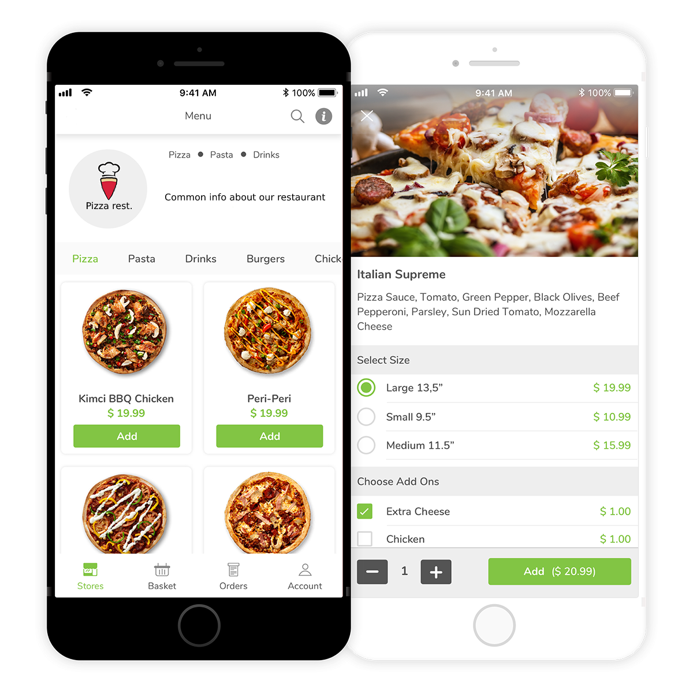

# Электронное меню для ресторанов - QuickMenu

Учебный проект [Kotlin Backend Developer](https://otus.ru/lessons/kotlin/)

## Описание

В данном учебном проекте разрабатывается сервис "электронное меню" для предоставления его Посетителям ресторана.

Для открытия страницы с актуальным меню Посетителю необходимо отсканировать QR-код находящийся на столе.

Владельцы ресторана могут в любой момент менять позиции в меню, доступность в данный момент и другие свойства

#### Реализация в текущем проекте:
* CRUDS для работы с позициями в меню
* CRUDS для работы с заказами

## Визуальная схема фронтенда

#### Пример фирменного QR-кода

## Документация

1. Маркетинг
    1. [Заинтересанты](./docs/01-marketing/02-stakeholders.md)
    2. [Целевая аудитория](./docs/01-marketing/01-target-audience.md)
    3. [Конкурентный анализ](./docs/01-marketing/03-concurrency.md)
    4. [Анализ экономики](./docs/01-marketing/04-economy.md)
    5. [Пользовательские истории](./docs/01-marketing/05-user-stories.md)
2. DevOps
    1. [Схема инфраструктуры](./docs/02-devops/01-infrastruture.md)
    2. [Схема мониторинга](./docs/02-devops/02-monitoring.md)
3. Тестирование
   1. [Тестирование пользовательских историй](./docs/03-testing/user-story.md)
4. Архитектура
   1. [Архитектурная диаграмма](./docs/04-architecture/01-arch.md)
   2. [Схема интеграции](./docs/04-architecture/02-integration.md)
   3. [Описание API](./docs/04-architecture/03-api.md)

## Структура проекта

| Название          | Описание                                                            |
|-------------------|---------------------------------------------------------------------|
| _m1l1-helloworld_ | Вводное занятие, создание первой программы на Kotlin                |
| _m2-menu_         | Модуль с проработанным маркетингом,базовым деплоем и архитектурой   |